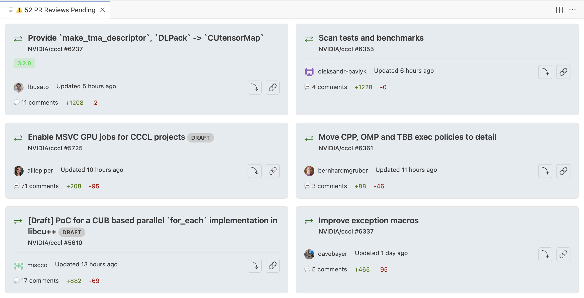

# Review Nudge - GitHub PR Reminder for VS Code

Never miss a GitHub PR review again! Review Nudge is a VS Code extension that automatically shows all pull requests assigned to you for review when you start VS Code, making sure they're front and center.



## Features

- **Auto-Show on Startup**: PR reviews automatically appear when VS Code starts - no need to remember to check
- **Prominent Display**: Full panel view opens automatically, impossible to miss
- **Warning Notifications**: Get notified with warning messages when you have pending reviews
- **Auto-Refresh**: Automatically checks for new PR reviews at configurable intervals
- **GitHub Integration**: Uses VS Code's built-in GitHub authentication (no tokens needed!)
- **Rich PR Information**: See PR title, repository, author, comments, changes, and more
- **One-Click Access**: Click any PR to open it directly in your browser
- **Dismiss Option**: Can dismiss the panel for the current session if you need to focus

## Installation

### From Source (Development)

1. Clone this repository
2. Install dependencies:
   ```bash
   npm install
   ```
3. Compile the extension:
   ```bash
   npm run compile
   ```
4. Press `F5` in VS Code to launch a new Extension Development Host window

### Building VSIX Package

To create an installable VSIX package:

1. Install vsce globally:
   ```bash
   npm install -g @vscode/vsce
   ```
2. Build the package:
   ```bash
   vsce package
   ```
3. Install the generated `.vsix` file in VS Code:
   - Open Command Palette (`Cmd+Shift+P` or `Ctrl+Shift+P`)
   - Run "Extensions: Install from VSIX..."
   - Select the generated `.vsix` file

## Usage

### How It Works

1. **On VS Code Startup**: The extension automatically opens a panel showing all your pending PR reviews
2. **Authentication**: If not authenticated, you'll be prompted to sign in with GitHub
3. **Automatic Display**: Your PR reviews will load immediately and display prominently
4. **Stay Updated**: The extension refreshes automatically every 5 minutes (configurable)

### Commands

- `Review Nudge: Show PR Reviews` - Manually open the PR reviews panel
- `Review Nudge: Refresh PR Reviews` - Manually refresh the PR list
- `Review Nudge: Dismiss PR Reviews (for this session)` - Close the panel for the current VS Code session

### Configuration

Open VS Code settings and search for "PR Review Reminder" to configure:

- **Auto Show on Startup** (default: `true`): Automatically show PR reviews when VS Code starts
- **Only Show When PRs Exist** (default: `false`): Only auto-show the panel if you have pending PR reviews
- **Refresh Interval** (default: `300000` ms / 5 minutes): How often to check for new reviews
- **Show Notifications** (default: `true`): Show desktop notifications for new reviews
- **GitHub Token** (Optional): Personal access token if you prefer not to use VS Code's authentication

## Requirements

- VS Code 1.95.0 or higher
- GitHub account
- Internet connection

## Authentication

The extension uses VS Code's built-in GitHub authentication by default, which is the recommended approach:
- No need to manage personal access tokens
- Secure authentication through VS Code
- Automatic token refresh

If you prefer, you can also use a personal access token:
1. Generate a token at https://github.com/settings/tokens
2. Required scopes: `repo`, `read:org`
3. Add the token in VS Code settings under "PR Review Reminder: GitHub Token"

## Privacy & Security

- Your GitHub credentials are managed securely by VS Code's authentication system
- The extension only requests necessary permissions (repo access for reading PRs)
- No data is stored externally or sent to third parties
- All PR data is fetched directly from GitHub's API

## Troubleshooting

### PR Panel Doesn't Show on Startup

1. Check settings: Ensure "Auto Show on Startup" is enabled
2. Check authentication: Make sure you're signed into GitHub
3. If "Only Show When PRs Exist" is enabled, the panel won't show if you have no pending reviews

### No PRs Showing

1. Make sure you're authenticated (look for the GitHub icon in the status bar)
2. Check that you have PRs assigned for review on GitHub
3. Try refreshing manually using the refresh button or command

### Authentication Issues

1. Sign out of GitHub in VS Code (click GitHub icon in status bar)
2. Sign back in when prompted
3. If issues persist, try using a personal access token

### Extension Not Loading

1. Check VS Code version (requires 1.95.0+)
2. Reload VS Code window (`Cmd+R` or `Ctrl+R` in developer tools)
3. Check the Output panel for error messages

## Development

### Project Structure

```
.
├── src/
│   ├── extension.ts         # Main extension entry point
│   ├── githubService.ts     # GitHub API integration
│   └── prReviewPanel.ts     # Panel webview implementation
├── package.json             # Extension manifest
├── tsconfig.json           # TypeScript configuration
└── README.md              # This file
```

### Building and Testing

```bash
# Install dependencies
npm install

# Compile TypeScript
npm run compile

# Watch mode for development
npm run watch

# Run linter
npm run lint

# Package extension
vsce package
```

## Why "In Your Face"?

This extension is designed to be impossible to ignore. PR reviews are an important part of the development workflow, and delayed reviews can block your teammates. By showing pending reviews immediately when VS Code starts, this extension ensures you never forget to review PRs.

## Contributing

Contributions are welcome! Please feel free to submit issues and pull requests.

## License

MIT

## Acknowledgments

This extension leverages VS Code's excellent GitHub integration and authentication system to provide a seamless, attention-grabbing experience for tracking PR reviews.